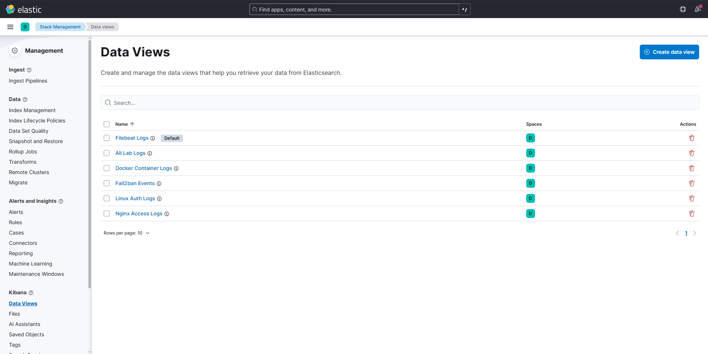
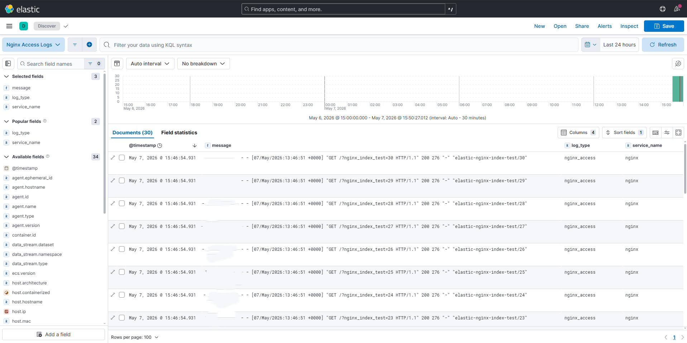
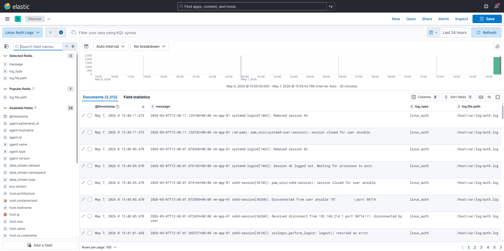
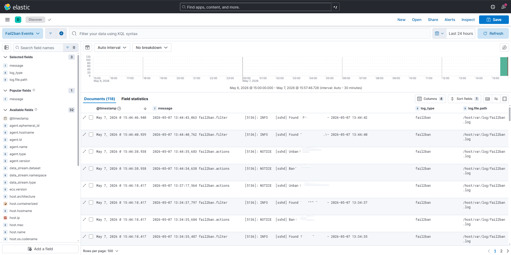

# Elastic Stack Logging Data Views

## Goal

Verify that centralized logging is deployed through Ansible and that Kibana provides separate Data Views for different log sources.

## Environment

- Host: Windows machine running VMware Workstation Pro
- Control node: WSL Ubuntu with Ansible
- Managed node: Ubuntu Server `vm-app-01`
- Logging stack: Elasticsearch, Kibana, Filebeat
- Deployment method: Docker Compose managed by Ansible

## Components

- Elasticsearch: stores and indexes logs
- Kibana: provides log search and visualization
- Filebeat: ships logs from the Linux host and Docker containers

## Log Sources

Filebeat collects and routes the following log sources:

| Source | Path | Elasticsearch index pattern |
|---|---|---|
| Linux authentication logs | `/var/log/auth.log` | `logs-linux-auth-*` |
| Fail2ban logs | `/var/log/fail2ban.log` | `logs-fail2ban-*` |
| Nginx access logs | `/opt/lab-nginx/logs/access.log` | `logs-nginx-access-*` |
| Docker container logs | `/var/lib/docker/containers/*/*.log` | `logs-docker-*` |

## Kibana Data Views

The following Kibana Data Views were created:

| Data View | Index pattern | Purpose |
|---|---|---|
| Linux Auth Logs | `logs-linux-auth-*` | SSH, sudo, authentication, and session events |
| Fail2ban Events | `logs-fail2ban-*` | Fail2ban ban, unban, and jail events |
| Nginx Access Logs | `logs-nginx-access-*` | HTTP requests to the lab Nginx service |
| Docker Container Logs | `logs-docker-*` | Logs from Docker containers |
| All Lab Logs | `logs-*` | Search across all lab log sources |

## Test Procedure

1. Deployed Elasticsearch, Kibana, and Filebeat using the Ansible `logging_stack` role.
2. Configured Filebeat to collect Linux authentication logs, Fail2ban logs, Nginx access logs, and Docker container logs.
3. Configured Filebeat to route each log source into a separate Elasticsearch index pattern.
4. Mounted Nginx access logs from the host into the Filebeat container.
5. Generated test HTTP traffic against the Nginx service.
6. Generated Fail2ban ban and unban events.
7. Verified that Elasticsearch created the expected `logs-*` indices.
8. Created Kibana Data Views for each log category.
9. Verified log visibility in Kibana Discover.

## Validation Commands

Check Elasticsearch:

```bash
curl http://<VM_IP_ADDRESS>:9200
```

Check logging indices:

```bash
curl "http://<VM_IP_ADDRESS>:9200/_cat/indices/logs-*?v"
```

Expected index patterns:

```txt
logs-linux-auth-*
logs-fail2ban-*
logs-nginx-access-*
logs-docker-*
```

Generate Nginx access logs:

```bash
for i in {1..20}; do
  curl -s -H "User-Agent: elastic-dataview-test/$i" "http://<VM_IP_ADDRESS>/?dataview=nginx-access-$i" > /dev/null
done
```

Generate Fail2ban events:

```bash
fail2ban-client set sshd banip 10.10.10.10
fail2ban-client set sshd unbanip 10.10.10.10
```

## Result

Centralized logging was successfully deployed.

Filebeat routes different log sources into separate Elasticsearch index patterns. Kibana Data Views allow switching between log categories without manually applying filters in Discover.

## Evidence

Screenshots:









## Notes

This setup demonstrates a centralized logging workflow similar to production environments:

- logs are collected from host and container sources
- log types are separated into dedicated Elasticsearch index patterns
- Kibana Data Views provide clean switching between log categories
- the setup is deployed through Ansible rather than manual container setup

The Elasticsearch cluster may show a `yellow` health status in this lab because it is running as a single-node deployment and replica shards cannot be allocated to another node.

Future improvements could include Kibana dashboard provisioning, ingest pipelines, structured parsing for Nginx access logs, and integration with a custom IDS component.
