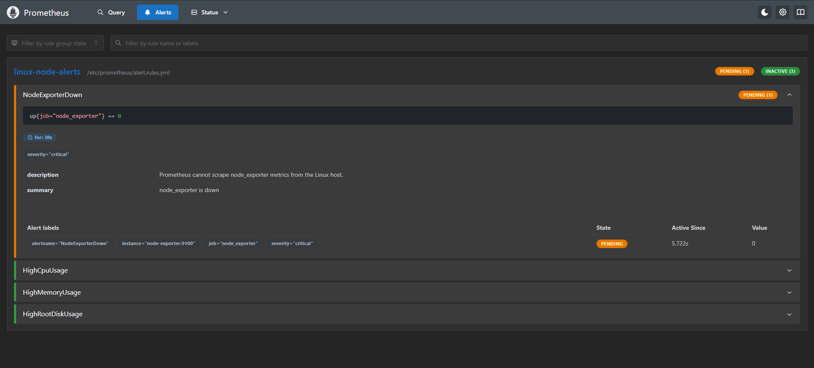

# Node Exporter Down Alert Test

## Goal

Verify that Prometheus detects a missing `node_exporter` target and triggers the `NodeExporterDown` alert.

## Environment

- Host: Windows machine running VMware Workstation Pro
- Control node: WSL Ubuntu with Ansible
- Managed node: Ubuntu Server `vm-app-01`
- Monitoring stack: Prometheus, Grafana, node_exporter
- Alert tested: `NodeExporterDown`

## Test Procedure

1. Stopped the `lab-node-exporter` container:

```bash
docker stop lab-node-exporter
```

2. Verified that the container was stopped:

```bash
docker ps -a --filter name=lab-node-exporter
```

3. Opened the Prometheus alerts page:

```txt
http://<VM_IP_ADDRESS>:9090/alerts
```

4. Waited for Prometheus to evaluate the alert rule.

5. Observed the `NodeExporterDown` alert in `PENDING` state.

6. Restored the service:

```bash
docker start lab-node-exporter
```

## Result

Prometheus detected that `node_exporter` was unavailable and triggered the `NodeExporterDown` alert.

Observed alert:

```txt
Alert: NodeExporterDown
Expression: up{job="node_exporter"} == 0
Severity: critical
State: PENDING
Value: 0
```

## Evidence

Screenshot:



## Recovery

The `lab-node-exporter` container was started again after the test.

After recovery, the target returned to the `UP` state in Prometheus.

## Notes

This test validates that Prometheus alert rules are not only loaded, but also functional during a simulated monitoring target outage.
