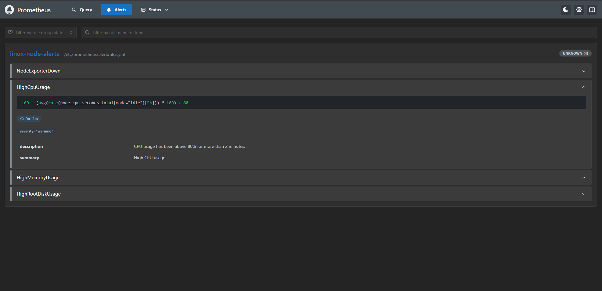

# Prometheus Alert Rules Validation

## Goal

Verify that Prometheus alerting rules are deployed through Ansible and loaded successfully by Prometheus.

## Environment

- Host: Windows machine running VMware Workstation Pro
- Control node: WSL Ubuntu with Ansible
- Managed node: Ubuntu Server `vm-app-01`
- Monitoring stack: Prometheus, Grafana, node_exporter
- Deployment method: Docker Compose managed by Ansible

## Alert Rules

The following Prometheus alert rules are deployed:

- `NodeExporterDown`
- `HighCpuUsage`
- `HighMemoryUsage`
- `HighRootDiskUsage`

## Test Procedure

1. Added Prometheus alert rules to the Ansible `monitoring_stack` role.
2. Mounted the alert rules file into the Prometheus container.
3. Updated the Prometheus configuration to load the alert rule file.
4. Re-ran the Ansible playbook.
5. Recreated the Prometheus container to apply the updated configuration.
6. Verified the Prometheus configuration with:

```bash
docker exec lab-prometheus promtool check config /etc/prometheus/prometheus.yml
```

7. Verified alert rule visibility in the Prometheus web UI:

```txt
http://<VM_IP_ADDRESS>:9090/alerts
```

## Result

Prometheus successfully loaded the configured alert rules.

The alert rules are visible in the Prometheus web UI under the Alerts page.

Expected alert rules:

```txt
NodeExporterDown
HighCpuUsage
HighMemoryUsage
HighRootDiskUsage
```

## Evidence

Screenshot:



## Notes

At this stage, alert rules are loaded and evaluated by Prometheus.

Alertmanager is not configured yet. This means alerts are visible in Prometheus, but they are not yet routed to external notification channels.

A future improvement would be to add Alertmanager and configure notification routing for critical alerts.
